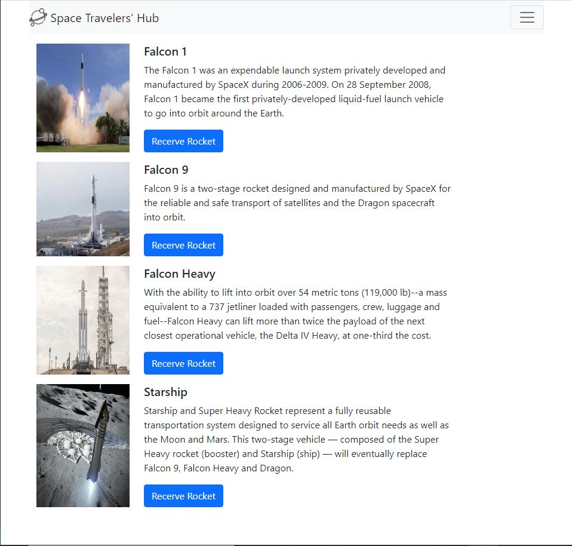

# Space Travelers Hub

> A Redux based application that allow users to book rockets and join selected space missions.



**Additional description about the project and its features.**

## ⚒️ Built With

`Languages`

- HTML
- CSS
- Javascript

`Library`

- React
- Redux

## 📡 Live Demo

[Link to Live Demo](https://ahzia.github.io/Space-Travelers/)

## 🧰 Tools

The following tools help make it easier to run this code.

- [Visual Studio Code](https://code.visualstudio.com/): A source code editor
- [git](https://git-scm.com/downloads): A tool for managing source code

## 🔥 Getting Started

### **Setup**

If you have installed git you can clone the code to your machine, or download a ZIP of all the files directly.
[Download the ZIP from this location](https://github.com/yaseerokino/space-travelers-hub/archive/refs/heads/develop.zip), or run the following [git](https://git-scm.com/downloads) command to clone the files to your machine:

```bash
git clone https://github.com/ahzia/Space-Travelers.git
```

### **Prerequisites**

To run this project you need [Node](https://nodejs.org/en/) and [NPM](https://docs.npmjs.com/about-npm-versions) installed on your local machine
<br>
`Note` : When you install Node.js, npm is automatically installed, However, npm is released more frequently than Node.js

### **Available Scripts**

In the project directory, you can run:

#### `npm start`

Runs the app in the development mode.\
Open [http://localhost:3000](http://localhost:3000) to view it in the browser.

The page will reload if you make edits.\
You will also see any lint errors in the console.

#### `npm test`

Launches the test runner in the interactive watch mode.\
See the section about [running tests](https://facebook.github.io/create-react-app/docs/running-tests) for more information.

#### `npm run build`

Builds the app for production to the `build` folder.\
It correctly bundles React in production mode and optimizes the build for the best performance.

The build is minified and the filenames include the hashes.\
Your app is ready to be deployed!

See the section about [deployment](https://facebook.github.io/create-react-app/docs/deployment) for more information.


## 🙎🏾‍♂️ Author

### Kossi-Stack

- GitHub: [@githubhandle](https://github.com/Kossi-stack/)
- LinkedIn: [LinkedIn](https://www.linkedin.com/in/kossifioklou2406/)


### Rustamxon

- GitHub: [@githubhandle](https://github.com/Rustamxon7)
- LinkedIn: [LinkedIn](https://www.linkedin.com/in/rustamjon-tolipov-6a831020b)


### Ahmad Zia Yousufi

- GitHub: [@ahzia](https://github.com/ahzia)
- Twitter: [@ZiaYousofi](https://twitter.com/ZiaYousofi)
- LinkedIn: [Ahmad zia Yousufi](https://https://www.linkedin.com/in/ah-ziayosfi)

## 👊🏾 Show your support

Give a ⭐️ if you like this project!

## 📝 License

This project is [MIT](./LICENSE) licensed.